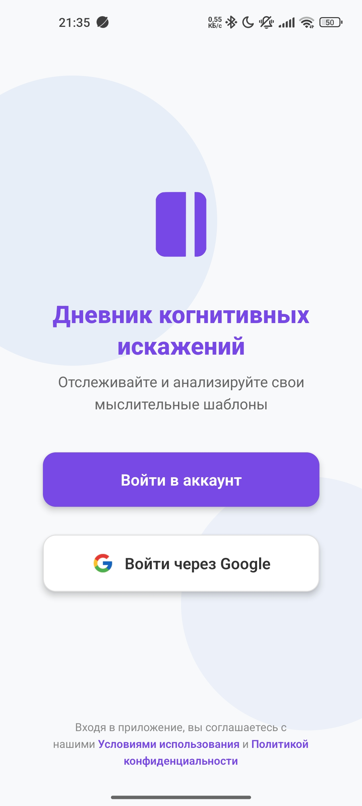
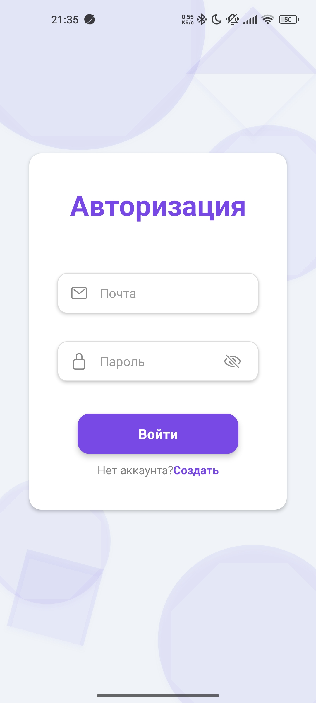
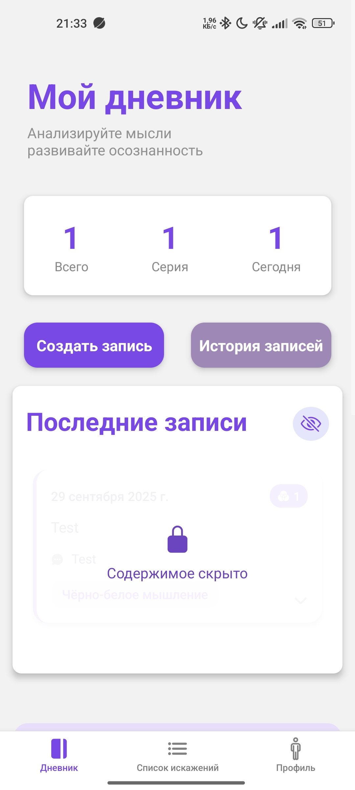
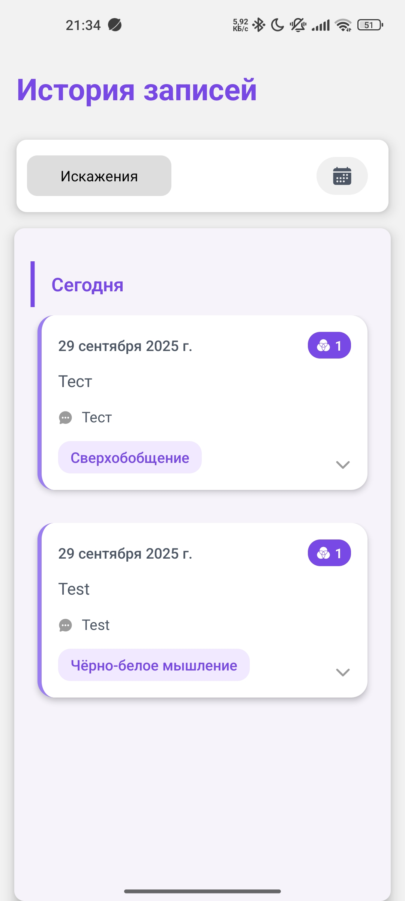
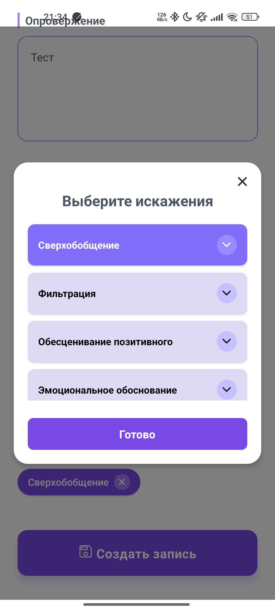
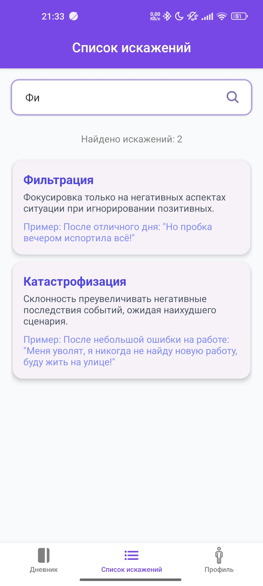

# 🧠 Cognitive Distortions Jurnal

Мобильное приложение для отслеживания когнитивных искажений 

## ✨ Особенности

- 📱 **Мобильный интерфейс** - оптимизирован для смартфонов
- 🧩 **Трекер искажений** - 10 видов когнитивных искажений
- 📊 **Статистика** - серия искажений
- 🔄 **Синхронизация** - Firebase Database
- 🔒 **Безопасность** - аутентификация Firebase Auth

## 🛠 Технологии

**Frontend:**
- React Native Ts
- Expo

**Backend:**
- Firebase Authentication
- Firestore Database

## Демо

  
  
  

--- 

    
    
    

